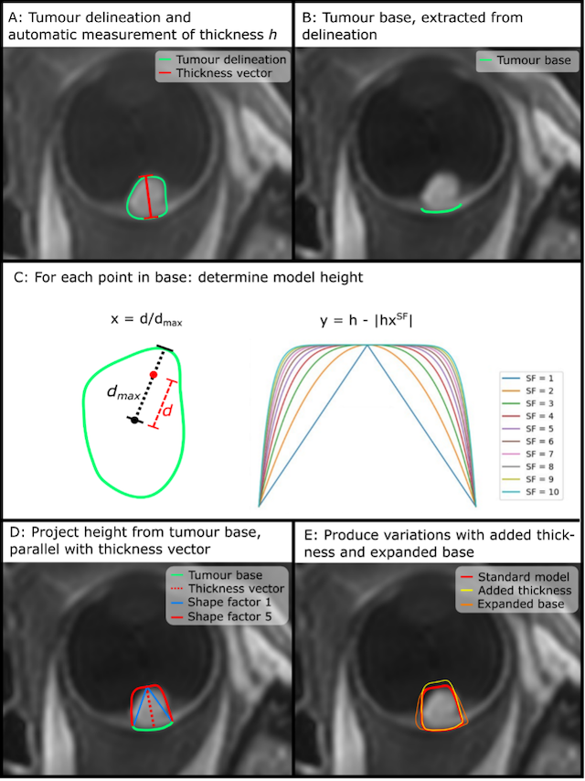
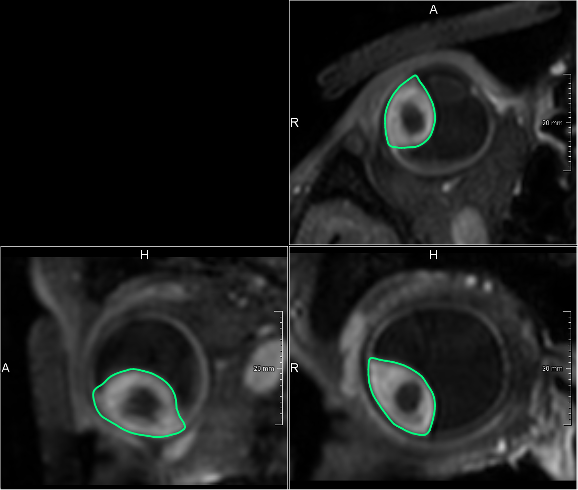

# OPT Tumour models

These scripts provide methods to generate polynomial tumour models, as commonly used in ocular proton therapy planning, based on 3D tumour delineations. Furthermore, it provides methods to compare the resulting model to the tumour delineations.  
The full method is described in Klaassen L, Rasch CRN, Beenakker JWM. Comparison of model-based and delineation-based target volume definition for ocular proton therapy. _Submitted_ (doi not available yet).

## Methods  
A summary of the methods is shown in this image:

**Figure 1**: Generation of a geometric tumour model from a delineated tumour contour.
(A) Tumours were delineated (green contour) and the thickness (red line) was determined automatically;
(B) the tumour base (green line) was extracted from delineation;
(C) for each point in the tumour base, model height was determined based on distance _d_ from base centre to the point, distance _dmax_ from base centre to outer contour in the same direction, thickness _h_ and shape factor _SF_;
(D) model height was projected from tumour base (green line), parallel to the thickness vector (dashed red line); 
(E) variations of the standard tumour model (red line) with added thickness (yellow line) and expanded tumour base (orange line) were produced as well.

## Requirements  
All scripts have been tested in Python 3.12.7. To run the scripts, the following packages are used:

- `NumPy` (version 1.26.4)
- `Scipy` (version 1.13.1)
- `Pandas` (version 2.2.2)
- `Matplotlib` (version 3.9.2)
- `Trimesh` (version 4.5.3)
- `Alphashape` (version 1.3.1)
- `Pymeshfix` (version 0.17.0)
- `Manifold3d` (version 3.0.1)
- `Shapely` (version 2.0.6)
- `Sklearn` (version 1.5.1)
- `Warnings`
- `tqdm`

## Example  
An [jupyter notebook example](example.ipynb), which generates tumour models with different shape factors, is provided. This example generates tumour models for the tumour as delineated below (Figure 2).

**Figure 2:** The example tumour was delineation on a 3D contrast-enhanced [T1-weighted MRI-scan](https://mreye.nl/protocols/mri_globe/).

## Warranty and liability

The code is provided as is, without any warranty. It is solely intended for research purposes. 
No warranty is given and no rights can be derived from it, as is also stated in the [MIT license](LICENSE).

## Contact  
Feel free to contact us for any inquiries:

- L. Klaassen (e-mail)
- J.W.M. Beenakker (jwb@mreye.nl)